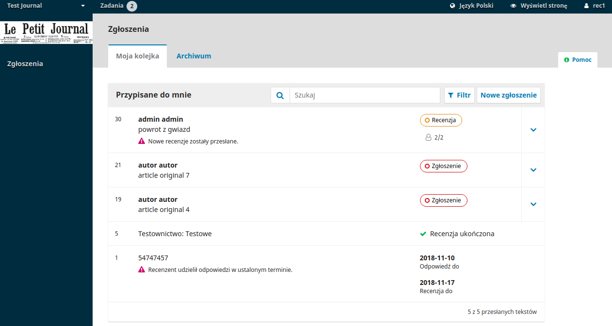

# Rozdział 12:	Recenzowanie
Niniejszy rozdział jest poświęcony procedurze recenzowania tekstów. Opisana tu metoda jest tożsama w wypadku zaproszeń  wysyłanych poprzez link w mailu jak i poprzez logowanie się do panelu. 

Wybierając w panelu tytuł artykułu lub klikając w link załączony do maila przechodzimy w obu przypadkach do szczegółów 

Zaproszenia do recenzji. Jest to widok znacznie okrojony w stosunku do widoku redaktora i nie zawiera informacji o autorze/ach. 

Pierwszy krok zawiera następujące elementy:

Prośba o wykonanie recenzji: Akapit informujący o zaproszeniu do przejrzenia tekstu w roli recenzenta.
Tytuł: Główny tytuł artykułu
Abstrakt: Tekst abstraktu
Przewijając ekran dalej w dół znajdziemy dalsze informacje o tekście.

Wyświetl wszystkie szczegóły złożonego tekstu: Kliknięcie linku spowoduje otwarcie zakładki ze wszystkimi metadanymi tekstu, pomijając dane mogące zidentyfikować autora.

Wyświetl wszystkie szczegóły złożonego tekstu: Kliknięcie linku spowoduje otwarcie zakładki ze wszystkimi metadanymi tekstu. System wybierze tylko te informacje które nie narusza podwójnie ślepej recenzji (o ile jest prowadzona w takim trybie).

Zamknięcie okna szczegółów i przesunięcie ekranu w dół odsłoni Harmonogram recenzji zawierający istotne terminy graniczne związane ze sformułowaniem recenzji.

Także z tego miejsca można odrzucić lub zaakceptować prośbę o recenzję. Jeśli zostanie wybrany klawisz odmowy, proces recenzji zostanie przerwany. Jeśli udzielisz zgody na sporządzenie recenzji formularz przejdzie do etapu II gdzie będzie można zapoznać się z zasadami pisania recenzji określonymi przez wydawcę. 

Należy odnotować że wszystkie pola w tej zakładce nie są edytowalne dla recenzenta a mają mu służyć jedynie do podjęcia przemyślanej decyzji o dokonaniu recenzji.

Kliknij Przejdź do kroku #3 aby móc pobrać kopię plików przeznaczonych do recenzji oraz wprowadzić komentarze recenzenta lub wypełnić formularz recenzji.

Poniżej pola w którym można pobrać kopie manuskryptu do recenzji wyświetli się formularz recenzji. Jeśli czasopismo nie ma zdefiniowanych precyzyjnych pytań i odpowiedzi zamiast formularza pokaże się zwykłe pole tekstowe.

Drugie okno z uwagami jest przeznaczone dla redaktora i widoczne tylko dla niego. (jest ono umieszczone poza formularzem recenzji).

Po przeczytaniu manuskryptu, wypełnieniu formularza recenzji, uwag dla redaktora jest jeszcze możliwość załadowania do recenzji pliku z naniesionymi bezpośrednio w artykule komentarzami. Należy przedtem pamiętać o usunięciu z dokumentu wszelkich informacji które mogłyby zidentyfikować osobę recenzenta. Dotyczy to zwłaszcza nagłówków komentarzy.

W Kroku #4 ma miejsce wybór rekomendacji dla redaktora: Do wyboru znajdują się poniższe opcje:

Zaakceptuj tekst : Tekst jest gotowy do korekty technicznej taki jaki jest.
Wymagane poprawki: Tekst wymaga drobnych poprawek które mogą zostać następnie ocenione przez redaktora.
Wymagane poprawki i powtórna recenzja:	Tekst wymaga poważnych zmian i kolejnej rundy recenzji.
Do zgłoszenia w innym czasopiśmie: Tekst nie odpowiada głównemu nurtowi zainteresowań czasopisma.
Odrzuć tekst: Tekst jest zbyt słaby aby go opublikować.

Rekomendacje w komentarzu: Jeśli żadna z powyższych propozycji nie jest zgodne z Twoją oceną możesz umieścić ja w polu komentarza dla redaktora aby opisać wszystkie szczegóły.

Naciśnięcie przycisku „Prześlij recenzję” powoduje zakończenie procesu recenzji i wywołanie komunikatu ostatecznie potwierdzającego decyzję.

Naciśnięcie  OK spowoduje przeniesienie do strony podziękowań. 

UWAGA! po tym etapie nie ma możliwości zmiany rekomendacji! 

To ostatni element ekranu recenzji. Wraz z jego pokazaniem się recenzja jest ukończona. 

Uwagi można zamieszczać jeszcze w poniższym panelu dyskusji, nie można jednak zmienić rekomendacji dla artykułu. 
